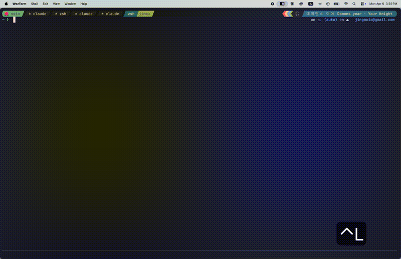

# sls (ssh ls)

A smart terminal dashboard for SSH hosts and Docker containers.
One command to find, connect, and manage everything you SSH into.



## Why sls?

You have 10 servers. Some run Docker containers. To reach a container, you SSH into the server, remember the container name, then `docker exec` into it. Every time.

sls flattens that into one step: pick the thing, you're in it.

```
sls > █
  11/11
  ⭐︎jgopi
  ⭐︎vaultwarden 🐳
  proxmox
  oci_atlas_0
    webdav 🐳
    coolify-proxy 🐳
  nas
    plex 🐳
    jellyfin 🐳
  RockyLinux
```

## Key Features

- **Built-in fuzzy finder** with inline search
- **Docker container discovery** across remote servers via SSH
- **One-step container access**: select a container, get a shell instantly
- **Favorites**: pin frequently used hosts and containers to the top (⭐)
- **Usage-based sorting**: most connected hosts float up automatically
- **Interactive dashboard**: rename, delete, scan, and star without leaving the UI
- **SSH config generation**: generate an include file so `ssh my-server--nginx` works everywhere
- **Safe writes**: atomic file operations protect your SSH config from corruption
- **Zero dependencies**: single binary, no runtime requirements

## Installation

### Homebrew (macOS)

```bash
brew tap jinmugo/tap
brew install sls
```

### Linux (Debian, Ubuntu, Fedora, RHEL, CentOS)

```bash
curl -fsSL https://package.jinmu.me/install.sh | sudo sh -s sls
```

### From Source

```bash
go install github.com/jinmugo/sls@latest
```

### Binary Release

Download platform-specific binaries from the [Releases](https://github.com/jinmugo/sls/releases) page.

## Quick Start

```bash
# Launch the interactive dashboard
sls

# Discover Docker containers on a remote server
sls discover my-server

# Connect directly to a container
sls connect my-server--nginx

# Generate SSH config so vanilla ssh works too
sls gen ssh-config
# Then: ssh my-server--nginx  (works without sls!)
```

## Dashboard Shortcuts

The interactive dashboard stays open after every action (except connect). Changes are reflected immediately.

### On SSH Hosts

| Key | Action |
|-----|--------|
| `enter` | Connect via SSH |
| `ctrl+s` | Scan for Docker containers |
| `ctrl+r` | Rename host alias |
| `ctrl+f` | Toggle ⭐ favorite |
| `ctrl+d` | Delete host (containers must be removed first) |
| `ctrl+j/k` | Navigate up/down |
| `esc` | Quit |

### On Containers

| Key | Action |
|-----|--------|
| `enter` | Open shell in container |
| `ctrl+r` | Rename (custom display name) |
| `ctrl+f` | Toggle ⭐ favorite (pinned to top) |
| `ctrl+d` | Remove from dashboard |
| `ctrl+j/k` | Navigate up/down |
| `esc` | Quit |

## Container Discovery

Discover running Docker containers on any SSH host:

```bash
sls discover my-server
```

This will:
1. SSH into the server and list running containers
2. Let you select which containers to add (multi-select with `space`)
3. Let you set custom names for each (e.g., `vaultwarden-hddaw38nxjcaf4ufzo79yh6i` → `vaultwarden`)
4. Cache the results locally

Discover all hosts at once:

```bash
sls discover --hosts              # scan all SSH config hosts (concurrent, max 10)
sls discover my-server --verbose  # show debug output
sls discover my-server -T 30s    # custom timeout
```

## SSH Config Generation

Generate an SSH config include file so you can reach containers with plain `ssh`:

```bash
sls gen ssh-config
```

This creates `~/.config/sls/ssh_config` with entries like:

```
Host my-server--nginx
    HostName 10.0.0.1
    User root
    RemoteCommand docker exec -it nginx /bin/sh
    RequestTTY yes
```

The `Include` directive is automatically added to your `~/.ssh/config`. After this, `ssh my-server--nginx` works from any terminal, even without sls installed.

## Other Commands

```bash
# Host management
sls config list
sls config add <alias>
sls config edit <alias>
sls config remove <alias>
sls config format              # reformat ~/.ssh/config

# Favorites (also available via ctrl+f in dashboard)
sls fav add <alias>
sls fav remove <alias>
sls fav list

# Tags
sls tag add <host> <tag>
sls tag remove <host> <tag>
sls tag list <host>
sls tag show
sls --tag <name>               # filter dashboard by tag

# Connectivity
sls test <host>                # test SSH connection
sls connect <host--container>  # direct container access

# Shell completion
sls completion [bash|zsh|fish|powershell]
```

## Configuration

| File | Purpose |
|------|---------|
| `~/.ssh/config` | SSH host definitions (read/write) |
| `~/.config/sls/meta.json` | Favorites, usage counts, tags |
| `~/.config/sls/containers.json` | Cached container data |
| `~/.config/sls/ssh_config` | Generated container SSH entries |

## Security

- Container names are validated against a strict allowlist (`[a-zA-Z0-9._-]`) to prevent SSH config injection
- All file writes use atomic temp-file-then-rename to prevent corruption
- The generated SSH config is a separate include file, never modifying your hand-crafted SSH config
- SSH connections use `BatchMode=yes` to prevent hanging on auth prompts during discovery
